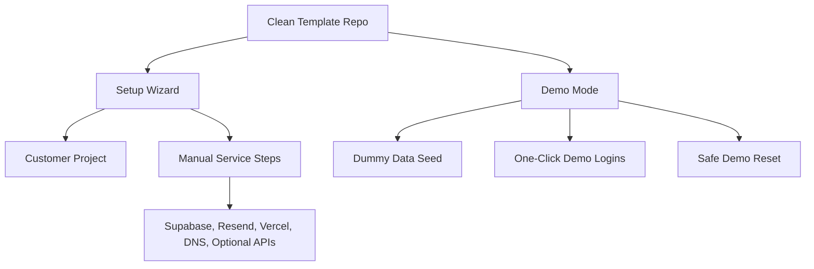

# Template Readiness: What Is Required Now

## Plain-English Summary

The repository has been cleaned and is now a strong starting point for a reusable DigiDocs-style template. It still needs productisation before it can be handed to a new customer or sold as a polished template product.

There are two separate goals:

1. **Reusable starter template**: a clean codebase that can be copied for a new customer, then configured through a setup wizard.
2. **Demo site**: a safe, working demo with dummy data that a potential client can log into and explore.

These two goals should share the same core app, but they should not be treated as the same thing. A starter template needs clean setup and configuration. A demo site needs realistic fake data, demo logins, safe email handling, and a reset button.

## Current Status

The codebase is already cleaned of known customer branding, real production links, private data exports, build artifacts, logs, and generated files. The app structure, UI, workflows, APIs, Supabase schema, migrations, tests, scripts, and deployment configuration have been preserved.

The template is not yet fully ready to sell or reuse without technical help because:

- A setup wizard now exists, but it still needs to stay aligned with the final customer handover flow.
- Setup, demo, validation, and database commands need to be kept under test before they can be trusted for each sale.
- The database setup path now uses a baseline/foundation/migration bootstrap, but it still needs validating against a clean Supabase project.
- Branding has a central config layer and should continue to be routed through it as new PDFs, emails, and pages are added.
- The demo data story now has a seed/reset foundation, but it still needs richer fictional module coverage for a polished sales demo.
- External services such as Supabase, Resend, Vercel, DNS, MapTiler, DVLA/MOT, and FleetSmart still need customer-owned accounts and keys.

## Goal 1: Reusable Starter Template With Setup Wizard

The first goal is to make this repository something you can copy for a new customer and configure with confidence.

The ideal experience should be:

1. Copy the template.
2. Run a setup wizard.
3. Enter the new customer's details.
4. Let the wizard update local configuration and create anything it safely can.
5. Follow simple instructions for anything the wizard cannot create itself.
6. Deploy the finished customer app.

### What The Setup Wizard Should Ask For

The wizard should collect all customer-specific information in one place:

- Customer company name.
- App name and short app name.
- Logo, favicon, app icons, and brand colours.
- Registered office or footer address for PDFs.
- Main admin email.
- Optional debug/admin support email.
- Public app URL.
- Supabase project URL.
- Supabase anon key.
- Supabase service role key.
- Database connection string for migrations.
- Resend sender email and API key.
- Vercel project details.
- Optional MapTiler key.
- Optional DVLA/MOT API settings.
- Optional FleetSmart API settings.
- Demo/test account preferences.
- Whether the project should include dummy data.

The setup wizard should then write those values into the correct local config files or environment templates.

### Current Template Files To Build From

These existing files are useful starting points:

- `D:\Websites\digidocs2\.env.example` lists the environment variables the wizard should collect or explain.
- `D:\Websites\digidocs2\README.md` explains the cleaned template at a high level.
- `D:\Websites\digidocs2\docs\guides\HOW_TO_RUN_MIGRATIONS.md` explains the safer migration pattern.
- `D:\Websites\digidocs2\docs\guides\MIGRATIONS_GUIDE.md` gives more detail for database setup.
- `D:\Websites\digidocs2\docs\guides\SAMPLE_DATA_INFO.md` describes the current sample data approach.
- `D:\Websites\digidocs2\scripts\seed\seed-sample-data.ts` is a starting point for starter/demo seed data.
- `D:\Websites\digidocs2\scripts\setup-test-users.ts` is a starting point for predictable test users.
- `D:\Websites\digidocs2\scripts\maintenance\setup-storage.ts` is a starting point for storage setup automation.
- `D:\Websites\digidocs2\export-summary\manual-review-notes.md` lists template-specific risks that should be handled before selling.

### What The Wizard Can Safely Automate

The wizard can reasonably automate local and app-owned tasks:

- Create or update `.env.local` from `.env.example`.
- Save customer branding into a central config file.
- Replace placeholder app names and PDF footer details.
- Check that required environment variables are present.
- Check that Supabase keys look valid without printing them.
- Run storage setup scripts after credentials are provided.
- Run database validation after migrations are applied.
- Seed demo or starter data when requested.
- Create a checklist showing what is complete and what still needs manual action.

### What The Wizard Should Not Pretend To Automate

Some services cannot be safely created by the app itself. The wizard should give clear instructions instead.

These should remain guided manual steps:

- Creating a Supabase account and project.
- Copying Supabase keys from the Supabase dashboard.
- Setting the database password and connection string.
- Creating or importing DNS records.
- Verifying a sending domain in Resend.
- Creating a Vercel account and linking the Git repository.
- Adding production environment variables in Vercel.
- Creating third-party API accounts for DVLA/MOT, MapTiler, or FleetSmart.
- Rotating secrets for each new customer.

The wizard can still help by linking to the correct dashboards and showing exactly which value is needed.

### Work Required Now For Goal 1

These are the main jobs needed before the template is easy to reuse:

1. **Keep setup script reliability verified**

   Some `package.json` scripts appear to point at old paths. For example, a script may call a file at the repo root while the actual file now lives in `scripts/seed/` or `scripts/maintenance/`.

   Required now:

   - Check every `npm run ...` setup, seed, storage, migration, and finalise command.
   - Fix any command that points to the wrong file.
   - Add clear command names such as `template:setup`, `template:validate`, `demo:seed`, and `demo:reset`.

2. **Validate one clean database bootstrap path**

   The template currently preserves the full Supabase migration history. That is useful for architecture, but it may be confusing for a brand-new customer database.

   Required now:

   - Decide whether new customers should use a clean baseline SQL file, the full migration history, or both.
   - Document the exact order for database setup.
   - Keep `npm run db:validate` as a required validation step after risky schema changes.

3. **Create a central customer config**

   Branding and customer details should not be scattered through PDFs, emails, manifests, and page metadata.

   Required now:

   - Add one central place for app name, company name, address, support email, sender email, brand colours, logo paths, and public URL.
   - Update PDFs, emails, app metadata, PWA manifests, and UI headers to read from that config.

4. **Maintain the setup wizard**

   The first version exists. It should remain simple and should not pretend to create every third-party service automatically.

   Required now:

   - A wizard flow that collects customer details.
   - A validation screen that shows missing fields.
   - A final checklist with manual setup steps.
   - A way to export or save the setup state.

5. **Create buyer-facing setup instructions**

   The wizard should be supported by plain-English documentation.

   Required now:

   - Explain Supabase setup.
   - Explain migrations or baseline import.
   - Explain storage buckets.
   - Explain Resend setup.
   - Explain Vercel deployment.
   - Explain optional integrations.
   - Explain demo data.

## Goal 2: Demo Site With Dummy Data

The second goal is to create a safe demo version that can be sent to potential clients.

The ideal demo should let a prospect:

1. Open a public demo URL.
2. Choose a role such as Admin, Manager, Employee, or Contractor.
3. Log in without needing real credentials.
4. Explore timesheets, inspections, maintenance, RAMS, quotes, absence, reports, messages, and admin screens.
5. See realistic dummy records.
6. Trigger safe demo-only actions.
7. Reset the demo back to a clean state when needed.

The demo must never send real emails to fake users, expose real data, or connect to a production customer database.

### Useful Ideas From `D:\Websites\digidocs`

The previous `D:\Websites\digidocs` example has several useful ideas that should be copied conceptually, not blindly copied file-for-file:

- **Demo login personas**: the login page presents clear demo roles with one-click sign-in.
- **Demo email safety**: fake demo email addresses are detected, and the app avoids accidentally sending email to them.
- **Demo email override modal**: when a demo user would receive an email, the UI can ask for a real recipient address instead.
- **Heavy demo seed script**: the demo has richer dummy data than a simple developer seed.
- **Storage setup script**: demo storage buckets can be created before seeding files.
- **Reset demo data route**: a guarded reset flow clears and rebuilds demo data.
- **Streaming reset progress**: the reset process reports progress back to the UI so the user knows what is happening.
- **Demo-only pages or notes**: some pages clearly say they are placeholders or demo views.

These ideas are valuable because a demo site needs to feel alive, but it also needs strong safety rails.

The most useful reference areas in the old example are:

- `D:\Websites\digidocs\app\(auth)\login\page.tsx` for demo login personas and explanatory demo copy.
- `D:\Websites\digidocs\scripts\create-demo-data.ts` for the idea of a rich demo dataset.
- `D:\Websites\digidocs\scripts\setup-demo-storage.ts` for demo storage preparation.
- `D:\Websites\digidocs\lib\utils\demo-email.ts` for detecting demo email addresses.
- `D:\Websites\digidocs\components\ui\demo-email-modal.tsx` for safely collecting a real recipient during a demo.
- `D:\Websites\digidocs\app\api\admin\reset-demo-data\route.ts` for the guarded demo reset pattern.
- `D:\Websites\digidocs\app\(dashboard)\debug\page.tsx` for reset confirmations and progress display.

### What The Demo Data Should Include

The demo should include enough dummy data to show the product properly:

- Demo admin user.
- Demo manager user.
- Demo employee user.
- Demo contractor or limited-access user.
- Teams and roles.
- Vehicles, HGVs, plant, and assets.
- Maintenance schedules and history.
- Timesheets across several weeks.
- Timesheet approval examples.
- Inspections with pass/fail items.
- Defects that generate workshop tasks.
- Workshop task comments and status changes.
- RAMS documents with fake signatures.
- Toolbox talks or messages.
- Absence requests and approvals.
- Customers and quotes.
- Reports with exportable dummy content.
- Notifications and example error/reporting data where useful.

The data should be obviously fake. Use `example.test`, `example.com`, fake names, fake registrations, and clearly fictional companies.

### Demo Email Safety

Demo email safety is required before sending the demo to prospects.

The demo should:

- Use a dedicated fake email domain, such as `demo.example.test`.
- Block real sending to fake demo addresses.
- Show a modal when a real email is needed for a demo action.
- Allow a prospect or salesperson to enter their real email only for that action.
- Clearly label when an email was simulated instead of sent.

This prevents accidental email delivery and makes demos safer.

### Demo Reset

A demo site should not slowly decay as people use it.

Required now:

- A protected `demo:reset` command or admin-only reset button.
- A reset process that clears demo records only.
- A seed process that recreates the full dummy dataset.
- Progress messages during reset.
- A clear warning that reset must never run against a customer production database.

### Work Required Now For Goal 2

1. **Create a full demo seed**

   The existing sample seed is a useful start, but the demo needs richer data across all major modules.

2. **Create demo login personas**

   Add one-click demo logins for the main roles. These should only appear in demo mode.

3. **Create demo email protections**

   Add a fake demo email domain, demo send blocking, and an override modal for actions that need a real recipient.

4. **Create demo reset**

   Add a safe reset command or guarded admin endpoint that restores the demo database to a known state.

5. **Create a separate demo deployment mode**

   The demo should have its own environment, database, Supabase project, Vercel project, and dummy data. It should not share infrastructure with real customer projects.

## Priority List

### Immediate Priority

These are required before the template is reliably usable:

- Fix setup and seed script paths.
- Decide the database bootstrap strategy.
- Add a central customer/template config.
- Expand `.env.example` if any required variables are still missing.
- Create plain setup instructions for Supabase, Resend, Vercel, and optional APIs.
- Create a minimum demo seed and document demo logins.

### Next Priority

These make the product easier to sell and repeat:

- Build the setup wizard.
- Add environment validation.
- Add storage setup automation.
- Add a full demo dataset.
- Add demo email safety.
- Add demo reset.
- Add a `template:audit` command to scan for secrets, real domains, generated files, and client-specific strings.

### Later Priority

These polish the template as a commercial product:

- Add a commercial licence.
- Add buyer documentation.
- Add screenshots or videos generated from dummy data only.
- Add a clean release checklist.
- Consider consolidating the historical migrations into a baseline migration for new customers.
- Add a hosted demo environment with scheduled reset.

## Suggested End State

The best long-term shape is:

- `template` mode for creating a new customer project.
- `demo` mode for public sales demos.
- `development` mode for local work.
- `production` mode for a real customer.

Each mode should have separate environment variables, separate data, and clear guardrails.

## What Must Be True Before Using This For A New Customer

- There is a clear setup path from empty repo to running app.
- Required scripts work from `package.json`.
- Customer branding can be changed from one place.
- Supabase setup is documented and repeatable.
- Storage setup is documented or scripted.
- Email setup is documented and safe.
- Secrets are never committed.
- Demo data is separate from customer data.
- Placeholder emails are replaced or configured.
- PDF and email branding show the new customer correctly.
- The app passes typecheck and lint after setup.

## What Must Be True Before Sending A Demo To A Potential Client

- The demo uses only dummy data.
- Demo users are easy to log in as.
- Demo emails cannot accidentally go to fake addresses.
- The demo can be reset.
- The demo database is separate from all customer databases.
- The demo URL is not connected to production customer services.
- Any placeholder or mock page is clearly labelled.
- Reports, PDFs, and exports show dummy data only.

## Final Recommendation

The cleaned repository is a good foundation. The next work should not be more cleanup first; it should be productisation.

The most useful next step is to build a small, reliable setup layer:

1. Fix the setup scripts.
2. Create a central customer config.
3. Decide the database bootstrap path.
4. Create the first version of the setup wizard.
5. Create the first resettable demo dataset.

Once those are done, this can become both a reusable starter for real customer projects and a convincing demo site for sales conversations.
